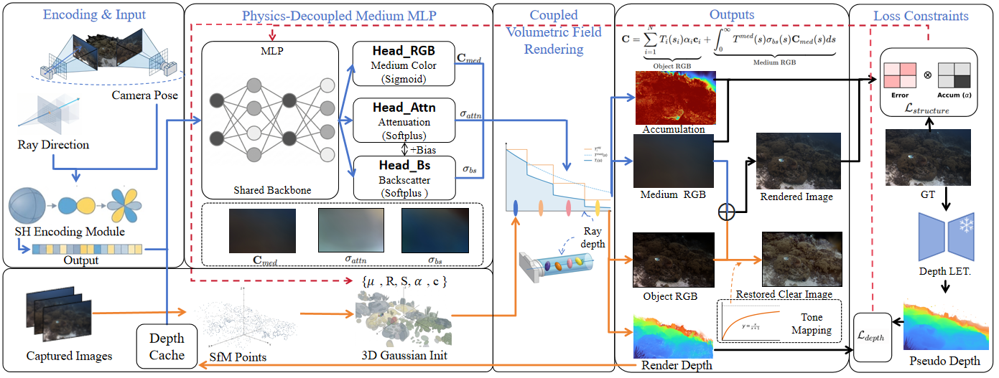

<p align="center">
  <h1 align="center">
    <span>PureSeaGS</span><br>
    <span style="font-size: 1.2rem; font-weight: normal;">Decoupled Physics-Aware 3D Gaussian Splatting for Underwater Scene Reconstruction</span>
  </h1>
  <p align="center">
    <a href="https://github.com/LZF">LZF</a>
  </p>
  <p align="center">
    <b><i>Under Review</i></b>
  </p>
  <p align="center">
    <a href="https://arxiv.org/abs/XXXX.XXXXX">📄 Paper</a> |
    <a href="https://puresea-gs.github.io/">🌐 Project Page</a>
  </p>
</p>

<br/>

<p align="center">
  
</p>

<p align="center" style="font-size: 1rem;">
  <strong>PureSeaGS</strong> explicitly decouples the continuous underwater medium from discrete 3D geometry via the Anisotropic Medium Field (AMF), achieving artifact-free rendering and clean depth.
</p>

<br/>

## 🔬 Abstract

Underwater 3D reconstruction inherently suffers from the physical conflict between continuous optical media and existing discrete representation methods. Applying explicit 3D Gaussian Splatting (3DGS) to continuous water volumes inevitably introduces a **representation mismatch**, causing severe **gradient entanglement** that forces the model to generate semi-transparent floater artifacts.

**PureSeaGS** resolves this at the architectural level with a physics-aware, prior-driven decoupled framework. The core innovation is the **Anisotropic Medium Field (AMF)** with separate prediction heads for distinct physical quantities:
- **Medium color** `C_med`
- **Spectral attenuation** `σ_attn`
- **Effective backscattering** `σ_bs`

This multi-head design achieves **feature-level decoupling** of physical parameters, effectively severing gradient interference between the continuous water volume and discrete scene geometry. We further introduce a **depth-guided enhancement mechanism** and a **physics-regularized loss formulation** to stabilize optimization.

Our method achieves state-of-the-art novel view synthesis: **PSNR 32.40 dB** on Curaçao — **+0.83 dB** over the best baseline — while maintaining real-time 3DGS rendering.

<br/>

## 🏗️ Method

<p align="center">
  
</p>

PureSeaGS follows a **decouple-then-couple** strategy:

1. **State Encoding** — SH-encoded ray directions capture view-dependent anisotropic scattering
2. **Physics-Decoupled Medium MLP (AMF)** — Shared backbone → three independent prediction heads, eliminating gradient interference
3. **Coupled Volumetric Field Rendering** — Physically integrates object radiance and medium scattering via Jaffe-McGlamery model
4. **Joint Loss Constraints** — Regularized L1 + SSIM with adaptive structure penalty and depth-guided conditioning

<br/>

## 📦 Installation

Built on [Nerfstudio](https://docs.nerf.studio/) with custom CUDA kernels.

### Prerequisites

```bash
conda create --name pureseags -y python=3.8
conda activate pureseags
python -m pip install --upgrade pip
```

### Install PureSeaGS

```bash
# PyTorch (CUDA 11.8)
pip uninstall torch torchvision functorch tinycudann
pip install torch==2.1.2+cu118 torchvision==0.16.2+cu118 --extra-index-url https://download.pytorch.org/whl/cu118

# CUDA toolkit
conda install -c "nvidia/label/cuda-11.8.0" cuda-toolkit

# tiny-cuda-nn
pip install ninja git+https://github.com/NVlabs/tiny-cuda-nn/#subdirectory=bindings/torch

# Nerfstudio
pip install nerfstudio==1.1.4
ns-install-cli

# PureSeaGS
git clone https://github.com/puresea-gs/pureseags.git
cd pureseags
git submodule init
git submodule update --recursive
pip install --no-use-pep517 -e .
```

<br/>

## 📊 Data

We use the [SeaThru-NeRF](https://sea-thru-nerf.github.io/) dataset (Curaçao, Panama, JapaneseGardens, IUI3-RedSea) and the Kaggle Underwater Benchmark (D3, D4, D5).

Preprocess with COLMAP:

```bash
colmap image_undistorter \
  --image_path /path/to/SeathruNeRF_dataset/IUI3-RedSea/images_wb \
  --input_path /path/to/SeathruNeRF_dataset/IUI3-RedSea/colmap/sparse/0 \
  --output_path /path/to/undistorted/IUI3-RedSea \
  --output_type COLMAP
```

<br/>

## 🚀 Training

```bash
ns-train pureseags --vis viewer+wandb colmap \
  --downscale-factor 1 \
  --colmap-path sparse \
  --data /path/to/undistorted/IUI3-RedSea \
  --images-path images
```

**Note:** Training/testing splits follow SeaThru-NeRF conventions (different from default nerfstudio splits).

<br/>

## 📈 Evaluation

```bash
ns-eval --load-config outputs/pureseags/CONFIG.yml --render-output-path renders/eval
ns-render camera-path --load-config outputs/pureseags/CONFIG.yml \
  --camera-path-filename /path/to/trajectory.json --output-path renders/video.mp4
```

<br/>

## 📚 Citation

```bibtex
@article{pureseags2025,
  title   = {PureSeaGS: Decoupled Physics-Aware 3D Gaussian Splatting
             for Underwater Scene Reconstruction},
  author  = {LZF},
  journal = {Under Review},
  year    = {2025}
}
```

<br/>

## 🙏 Acknowledgements

This work builds upon [WaterSplatting](https://github.com/water-splatting/water-splatting) (3DV 2025), [Nerfstudio](https://docs.nerf.studio/), and [3D Gaussian Splatting](https://repo-sam.inria.fr/fungraph/3d-gaussian-splatting/). We thank the SeaThru-NeRF authors for their dataset.

<br/>

## 📄 License

Apache License 2.0. See [LICENSE](LICENSE).
